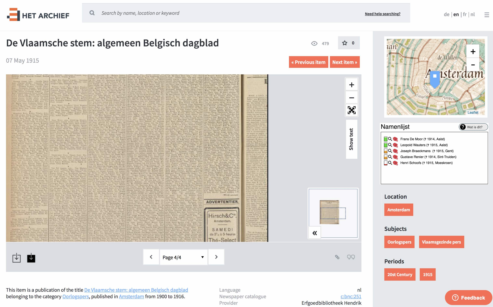
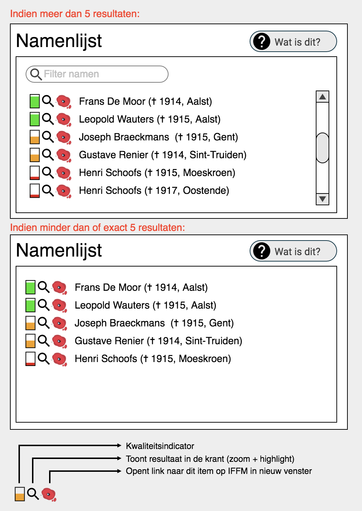

# Linked Open Data

## Important note
**All items that have content provider "CEGESOMA" should not have any JSON-LD and should be 'skipped' (as per our license agreement with them).**

## Implementation

### jsonld on media pages
On each media page [jsonld](https://json-ld.org/) information must be made available. This jsonld information is based on the metadata of the current item.

This content should be added to the `<head>` tag of those pages.

I.e. 

```
<head>
   ...
   <script type="application/ld+json">
    JSONLDHERE
   </script>
   ...
```
   

Where JSONLD HERE would contain the JSON-LD, an example of this would be:

```json
[{
		"@context": ["http://schema.org/", {
			"dcterms": "http://purl.org/dc/terms/",
			"rdfs": "http://www.w3.org/2000/01/rdf-schema#",
			"languageLabel": {
				"@id": "schema:inLanguage",
				"@type": "xsd:String"
			},
			"languageConcept": {
				"@id": "schema:inLanguage",
				"@type": "@id"
			},
			"label": "rdfs:label",
			"title": "dcterms:title",
			"xsd": "http://www.w3.org/2001/XMLSchema#",
			"sio": "http://semanticscience.org/resource/",
			"pageNumber": {
				"@id": "sio:SIO_000787",
				"@type": "xsd:String"
			},
			"topicOf": {
				"@id": "http://xmlns.com/foaf/0.1/topicOf",
				"@type": "@id"
			},
			"license": {
				"@id": "dcterms:license",
				"@type": "@id"
			},
			"createdDate": {
				"@id": "dcterms:created",
				"@type": "xsd:date"
			},
			"createdYearMonth": {
				"@id": "dcterms:created",
				"@type": "xsd:gYearMonth"
			},
			"mentions": {
				"@id": "schema:mentions",
				"@type": "@id"
			},
			"seeAlsoOCR": {
				"@id": "foaf:page",
				"@type": "@id"
			}
		}],
		"@id": "https://hetarchief.be/media/de-school-op-het-front-studiebladen-van-sursum-corda/CMEPpOVIRqYiVZSYd3Q3k8tL",
		"license": "https://creativecommons.org/publicdomain/zero/1.0/",
		"seeAlsoOCR": "https://hetarchief.be/media/de-school-op-het-front-studiebladen-van-sursum-corda/CMEPpOVIRqYiVZSYd3Q3k8tL/ocr",

		"@graph": [{
			"@id": "https://hetarchief.be/pid/0000000j7k",
			"@type": "schema:Newspaper",
			"datePublished": "1918-05-01",
			"headline": "De school op het front: Studiebladen van Sursum Corda",
			"languageLabel": "nl",
			"languageConcept": "nld",
			"publisher": "Erfgoedbibliotheek Hendrik Conscience",
			"title": "De school op het front: Studiebladen van Sursum Corda",
			"createdDate": "1918-05-01",
			"createdYearMonth": "1918-05",
			"topicOf": ["http://anet.be/record/abraham/opacbnc/c:bnc:6656",
				"https://lib.ugent.be/catalog/ser01:000147400"
			],
			"hasPart": [{
					"@id": "https://hetarchief.be/pid/0000000j7k/1",
					"@type": "schema:CreativeWork",
					"datePublished": "1918-05-01",
					"headline": "De school op het front: Studiebladen van Sursum Corda",
					"languageLabel": "nl",
					"publisher": "Erfgoedbibliotheek Hendrik Conscience",
					"title": "De school op het front: Studiebladen van Sursum Corda",
					"createdDate": "1918-05-01",
					"topicOf": ["http://anet.be/record/abraham/opacbnc/c:bnc:6656",
						"https://lib.ugent.be/catalog/ser01:000147400"
					],
					"pageNumber": "1"
				},
				{
					"@id": "https://hetarchief.be/pid/0000000j7k/2",
					"@type": "schema:CreativeWork",
					"datePublished": "1918-05-01",
					"headline": "De school op het front: Studiebladen van Sursum Corda",
					"languageLabel": "nl",
					"publisher": "Erfgoedbibliotheek Hendrik Conscience",
					"title": "De school op het front: Studiebladen van Sursum Corda",
					"created": "1918-05-01",
					"topicOf": ["http://anet.be/record/abraham/opacbnc/c:bnc:6656",
						"https://lib.ugent.be/catalog/ser01:000147400"
					],
					"pageNumber": "2"
				}
			]
		}]

	},
	... HERE ALL THE "MENTIONS" ARE ADDED ...
	{
		"@context": "http://www.w3.org/ns/hydra/context.jsonld",
		"@id": "https://hetarchief.be/media/de-school-op-het-front-studiebladen-van-sursum-corda/CMEPpOVIRqYiVZSYd3Q3k8tL",
		"previous": "https://hetarchief.be/media/vrij-belgië/B1IVhaOMLFgCUGNJkVGuZH3S",
		"next": "https://hetarchief.be/media/vrij-belgië/J1cnCMfndMbBNrde9VxIyVpB"
	}
]
```

##### @graph.hasPart

The `@graph` `hasPart` contains each page as a separate entry.


##### External "mentions"
The `... HERE ALL THE "MENTIONS" ARE ADDED ...` part contains each entry a `mentions` key contains a list of several possible relevant links. These links can contain structured data or simply text. They will be supplied by a csv file than we can upload ourselves in the backend. 
This data will in later projects be re-used to eg. display some recognized names in the frontend or to allow searching on specific mentions such as a city name (see below in section "Mentions").

##### previous and next links

The purpose is that the entire set is easily traversible by a crawler. By visiting a url, and then visiting the "next" and "previous" links for each of those documents until it has no more "next"/"previous" value users are able to traverse the entire linked open data repository. The values for the previous and next are preferably determined by the publication date of the available items. Equally possible is that they are determined by some table index.

The most important here that it is consistent, i.e. when crawling the "next" item of item A (let's call it item B), the "previous" on that item B should refer back to item A.


##### other

The mapping from the other metadata to the jsonld fields should mostly be obvious from the given example.

### ocr text
Each jsonld has a link to a separate jsonld specifically relating to the OCR text of that media page (see the entry `seeAlsoOCR`).

For these urls the server should return a jsonld specifically containing the OCR text per page, for example:

```json
{
    "@context": {
    "dcterms": "http://purl.org/dc/terms/",
    "hydra": "http://www.w3.org/ns/hydra/core#",
    "schema" : "http://schema.org/",
    "xsd": "http://www.w3.org/2001/XMLSchema#",
    "foaf:topicOf": {
        "@id": "http://xmlns.com/foaf/0.1/topicOf",
        "@type": "@id"
    },
    "dcterms:license": {
        "@type": "@id"
    }
  },
  "@id" : "https://hetarchief.be/nl/media/de-school-op-het-front-studiebladen-van-sursum-corda/CMEPpOVIRqYiVZSYd3Q3k8tL/ocr",
  "dcterms:license": "https://hetarchief.be/nl/gebruiksvoorwaarden",
  "foaf:topicOf": "https://hetarchief.be/nl/pid/0000000j7k",
  "@graph" : [
    {
        "@id": "https://hetarchief.be/nl/pid/0000000j7k/1",
        "schema:text": "geëncodeerde OCR-tekst pagina 1",
        "dcterms:description": "geëncodeerde OCR-tekst pagina 1"
    },
    {
        "@id": "https://hetarchief.be/nl/pid/0000000j7k/2",
        "schema:text": "geëncodeerde OCR-tekst pagina 2",
        "dcterms:description": "geëncodeerde OCR-tekst pagina 2"
    },
    {
        "@id": "https://hetarchief.be/nl/pid/0000000j7k/3",
        "schema:text": "geëncodeerde OCR-tekst pagina 3",
        "dcterms:description": "geëncodeerde OCR-tekst pagina 3"
    }
  ]
}
```
### Mentions
#### Table structure
We expect a table with the following structure, the csv will use these names in its header row, the actual column names of the table are to be determined at your discretion.

##### Columns

- pid (char)
- page (int) 
- type (char) For now it will only contain 'namenlijst', but in the future more types will be added such as for example "location" or "wikidata"
- external_id (varchar or char, needs to support up to 64 char) Containing the id specific of this type (eg. for easy linking to external partner)
- name (varchar) The name or label of the entity, eg. "Marcel Verhoeven", this can be used to highlight this in the OCR text or possibly for searches in the future.
- lod (text, contains raw json) which will be directly output in the `mentions` part of the Linked Open Data json
- meta (text) Some extra information that can be used for frontend purposes (eg. date of death, place)

`type` and `external_id` may be ascii only, `name` and `details` should support UTF-8 characters. 
If for index purposes you would prefer `type` to be short, we can use 3-letter codes to differentiate (eg. 'nml' for namenlijst). This decision is left at your discretion.

##### Indices
We expect sensible indices on this table, i.e. 

 - key on `pid`, `type`
 - unique on `pid`, `page`, `type`, `external_id`, `name`

#### CSV import

The backend should provide a page for importing csv's. The used csv file will comply to RFC4180, including a header row. The csv structure (i.e. the used columns) is that of the "Columns" section as described above.

Example csv (order of header fields may change):

```csv
pid,page,type,external_id,name,lod,meta
4j09w09v3z,4,namenlijst,76d1c507-1306-4a5a-97f1-8ebfead154cc,"Hugo Meyer","{""http://purl.org/ontology/af/confidence"":""0.88"",""@graph"":[{""@id"":""https://hetarchief.be/pid/4j09w09v3z/4"",""http://schema.org/mentions"":[{""@id"":""http://culturize.ilabt.imec.be/soldiers/data/76d1c507-1306-4a5a-97f1-8ebfead154cc"",""@type"":""Person"",""name"":""Hugo Meyer"",""label"":""Hugo Meyer"",""topicOf"":{""@id"":""https://database.namenlijst.be/publicsearch/#/person/_id=76d1c507-1306-4a5a-97f1-8ebfead154cc"",""partOf"":""https://database.namenlijst.be""}}]}]}","{""name"":""Hugo Meyer"",""subtitle"":""\u2020 1916, Scheldewindeke"",""quality"":0.88}"
```

##### Notes
- The data should be imported as a `REPLACE INTO` or `INSERT INTO ... ON DUPLICATE KEY UPDATE details = VALUES(details), meta = VALUE(meta)` (i.e. automatical updates)
- Deletes: since we don't have direct access to the database table, we must be able to delete rows by providing an empty `details` column, or by another page where we can upload a csv containing a list of  `pid`, `page`, `type`, `external_id`, `name` (= the unique key) for deletion. (Either option is fine and the choice is left at your discretion)
- Provide a functionality to export the data as either a csv or an sql dump


#### Usage of the data from the table
Extra metadata using "mentions" can be read from a database table and can be output directly in the jsonld document. 

I.e. something like:

```php
...

	},
	<?php echo implode(",\n", $mentions); ?>
	,
	{
		"@context": "http://www.w3.org/ns/hydra/context.jsonld",
...
```

where `mentions` is an array of values of the `lod` column.

## IFFM Namenlijst

The first "mentions" data that will be made available is data from IFFM Namenlijst Database. Results will also be used in a frontend block (cf. mockup below).

### Mock up

#### Location on page



(the block will only be shown if data is available)

#### Mockup details



##### Functionality
- The button "Wat is dit?" will link to an answer on the FAQ page containing more information (link tbd).

Icons:

- For the icons in front of each name there has to be an HTML "title" attribute or tooltip with a description of what the icon means/does. The used texts for this are tbd.
- The first icon "Kwaliteitsindicator" is the only icon that isn't clickable
- On clicking the magnifying glass icon (🔍), the asset view block should highlight all occurences of that match and zoom/center to the first occurence (as well as change to correct page if necessary)

##### Data mappings

The data used in this new block originates from the following db table fields (see "Mentions"):

- `external_id` 
- `name` Name as used inside the OCR-text (most likely lowercased and all accents removed, so the ocr-text might need to be "normalized" first)
- `meta` will contain a json object with keys `name`, `quality` and `subtitle`

The variables will be used in the following way (cf. mockup):

 - `external_id` for generating a link to IFFM namenlijst, will probably be `"https://database.namenlijst.be/publicsearch/#/person/_id=" + $external_id`
 - `name` for usage in the magnifying glass icon (🔍) functionality, this is the exact text that is used in the OCR that needs to be marked.
 - `meta.quality` for generating the correct "Kwaliteitsindicator" icon. `quality` is a percentage (number from 0 to 100). This icon should be red if `quality < 40`, orange if `40 <= quality < 70` and green if `quality >= 70` (the exact values may be subject to change).
 - `meta.name` For showing the names in the list
 - `meta.subtitle` This will already contain the extra details such as year of death and location of death if available. It can be displayed 'as-is' (obviously it only does need to be html escaped).
